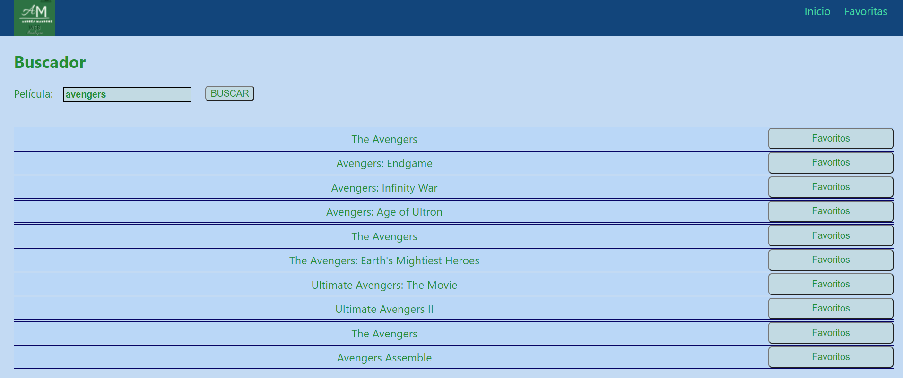
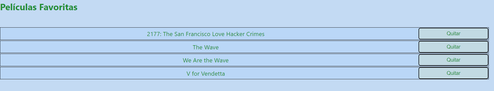
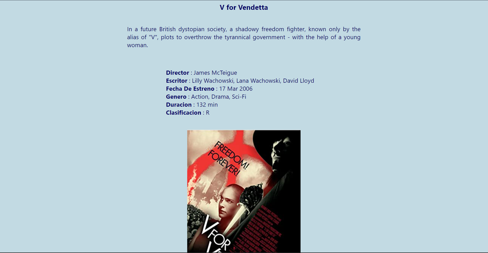

# App Peliculas

Esta app hace uso de react, junto con redux, se utiliza la API OMDb para obtener la informacion de las peliculas que se muestran  

## Descripción

La app nos permite buscar peliculas en uno de los más amplios catalogos de internet, en el inicio contamos con un buscador donde ingresar el titulo que queremos, al realizar la busqueda se presentaran como maximo 10 resultados que coinsidan con la busqueda, los resultados pueden ser añadidos a la seccion favoritos y ser vistos individualmente con mas detalle

## Instalacion 

Realizar **npm install**  en la carpeta del proyecto, para bajar las dependencias necesarias, cuando la instalacion termine inicializar con **npm start** 